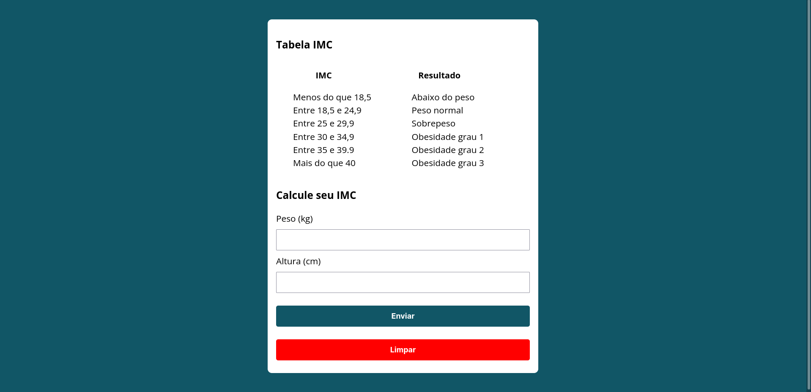

# Calculadora de imc 📚

<!---Esses são exemplos. Veja https://shields.io para outras pessoas ou para personalizar este conjunto de escudos. Você pode querer incluir dependências, status do projeto e informações de licença aqui--->
<h1>
  Tecnologias 👨‍💻
  </br>
  <div align="center">
    
    
    
  </div>
</h1>

<p align="center">
  
</p>

> Link da aplicação: <a href="https://drb-diego.github.io/calculadora-de-imc">Calculadora de imc</a>

## 🖖🏼 Objetivo
O objetivo desse projeto é criar uma calculadora que mede seu índice de massa corporal ou IMC e exercitar tecnologias que eu aprendi recentemente, como por exemplo, JavaScript e como monipular HTLM atraves do DOM.

### Ajustes e melhorias

Projeto concluido ✅:

- [x] Adicionar peso
- [x] Adicionar altura
- [x] Calcular imc

## 💻 Pré-requisitos

Antes de começar, verifique se você atendeu aos seguintes requisitos:
<!---Estes são apenas requisitos de exemplo. Adicionar, duplicar ou remover conforme necessário--->
* Ter instalado uma versão de um navegador recente

## 🚀 Instalando Calculadora de imc

Para instalar o Calculadora de imc, siga estas etapas:

</br>

***Linux e macOS:***

**Clone o repositório**
```
  git clone https://github.com/Drb-Diego/calculadora-de-imc.git
```

Depois Abra o arquivo "index.html" no seu navegador de preferencia

</br>

***Windows:***

**Clone o repositório**

```
  git clone https://github.com/Drb-Diego/calculadora-de-imc.git
```


Depois Abra o arquivo "index.html" no seu navegador de preferencia
